# Sinamawin


**<ins>Si</ins>mple <ins>N</ins>etwork <ins>A</ins>dapter <ins>Ma</ins>nager for <ins>Win</ins>dows**

A quick and easy way **to manage network adapters** in Windows (only **IPv4**).

⏬ [Download](https://github.com/javierorp/Sinamawin/releases)

If you detect any error, have any doubt, suggestion or want to contact me you can do it via:

[](https://es.linkedin.com/in/javierortipriego) &ensp; [](https://github.com/javierorp) &ensp; [](mailto:javierorp@outlook.com)

## Table of Contents

- [Sinamawin](#sinamawin)
  - [Table of Contents](#table-of-contents)
  - [Features](#features)
    - [🔍 View the network adapters](#-view-the-network-adapters)
    - [🆕 New network adapter detected](#-new-network-adapter-detected)
    - [📋 Copy/export all the relevant information](#-copyexport-all-the-relevant-information)
    - [🔌 Enable/disable network adapters effortlessly](#-enabledisable-network-adapters-effortlessly)
    - [🔄 Change the configuration of the adapters easily](#-change-the-configuration-of-the-adapters-easily)
    - [⚙ Set DHCP for a network adapter without hassle](#-set-dhcp-for-a-network-adapter-without-hassle)
    - [💾 Manage profiles to apply them later to the adapters](#-manage-profiles-to-apply-them-later-to-the-adapters)
    - [🔬 ARP (Address Resolution Protocol)](#-arp-address-resolution-protocol)
    - [👁️ Nmap (Network Mapper)](#️-nmap-network-mapper)
    - [👕 Dress as you like](#-dress-as-you-like)
  - [Tested screen resolutions](#tested-screen-resolutions)
  - [Licenses](#licenses)

## Features

- [x] 🔍 View all network adapters in your computer with ease.

- [x] 🆕 Detect when a new network adapter is connected.

- [x] 📋 Copy/Export detailed information of each network adapter (name, description, status, MAC address, IP address...)

- [x] 🔌 Enable/disable network adapters effortlessly.

- [x] 🔄 Change adapter configurations with ease, ensuring your settings stick until your next restart (PolicyStore: ActiveStore).

- [x] ⚙ Set DHCP configurations for any network adapter hassle-free.

- [x] 💾 Manage profiles (add, delete, import and export) for seamless application to network adapters.

- [x] 🔬 Display the ARP table of an interface, which allows you to know the MAC address of the network adapter of the device to which it is connected.

- [x] 👁️ Port scanning with Nmap ( separate installation required).

- [x] 👕 Change the theme of the application to the one that best suits you.

> [!NOTE]
> To modify the properties of the network adapters it is required to **run the application as an administrator**. Otherwise, a banner will appear at the top.

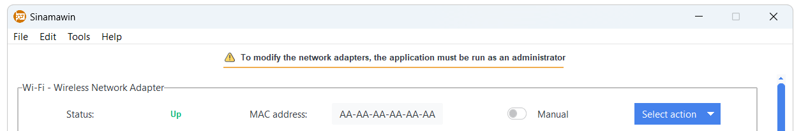

### 🔍 View the network adapters

All the information about the network adapters detected on your computer in one place and quick to view (status, MAC address, IP address, subnet mask, default gateway, preferred DNS server, alternate DNS server, prefix origin and suffix origin).

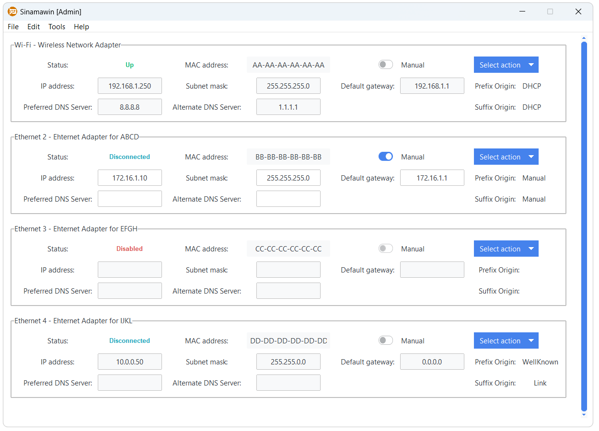

### 🆕 New network adapter detected

The application scans the network adapters connected to the computer when the application is launched. If the information is to be refreshed, the "Refresh" option is available in "File" or by pressing Ctrl+R. If a new network adapter is detected it is highlighted.

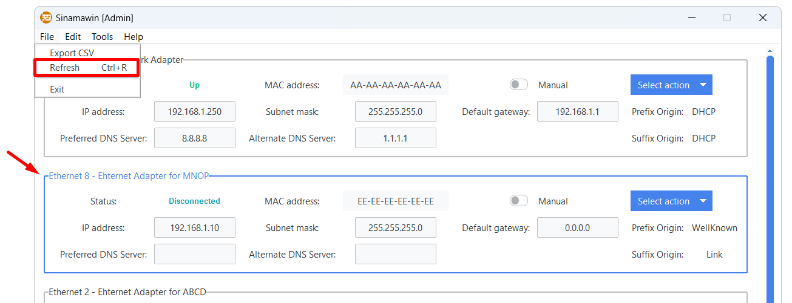

### 📋 Copy/export all the relevant information

The information of a network adapter can be copied to the clipboard using the "Copy information" option under the "Select action" menu.

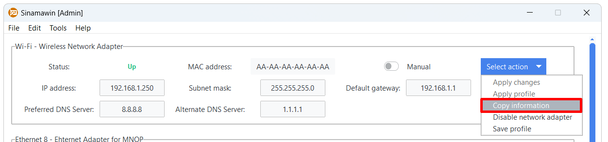

The information available in the clipboard would be:

```Text
Index: 1
Name: Wi-Fi
Description: Wireless Network Adapter
Status: Up
MAC address: AA-AA-AA-AA-AA-AA
IP address: 192.168.1.250
Subnet mask: 255.255.255.0
Default gateway: 192.168.1.1
Prefix Origin: DHCP
Suffix Origin: DHCP
Preferred DNS Server: 8.8.8.8
Alternate DNS Server: 1.1.1.1
```

In addition, the information of all network adapters can be exported to CSV from the "Export CSV" option in "File".

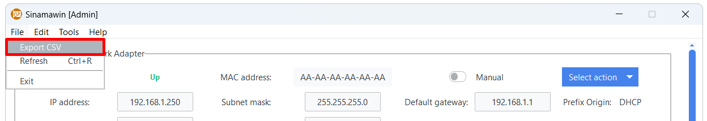

### 🔌 Enable/disable network adapters effortlessly

From the "Select action" menu a network adapter can be enabled or disabled.

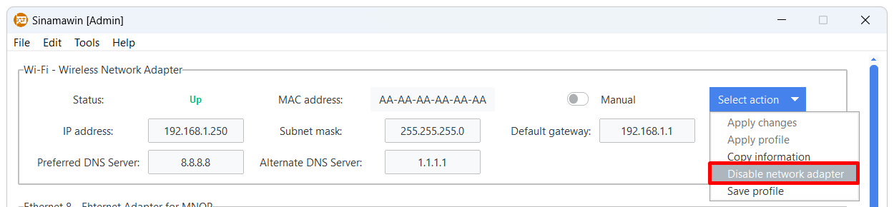

### 🔄 Change the configuration of the adapters easily

The main purpose of the application is to be able to quickly and easily change the configuration of network adapters instead of jumping between Windows menus. It is only necessary to enable the "Manual" option to modify the network adapter configuration and, when finished, click on "Apply changes" in the "Select action" menu.

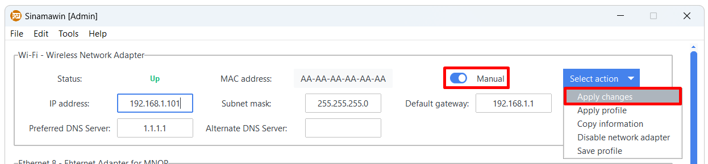

A summary window will appear to confirm the changes.

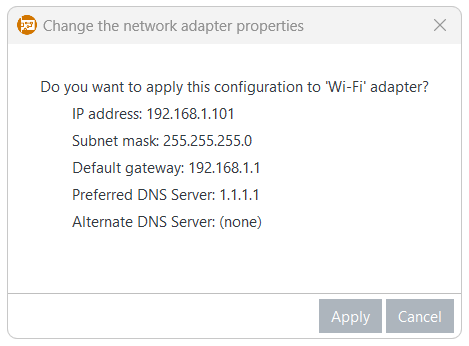

### ⚙ Set DHCP for a network adapter without hassle

To enable the DHCP (Dynamic Host Configuration Protocol) protocol on a network adapter it must be manually configured. When disabling the "Manual" option, a confirmation window to enable DHCP will appear. This will also cause the DNS servers to be automatically fetched.

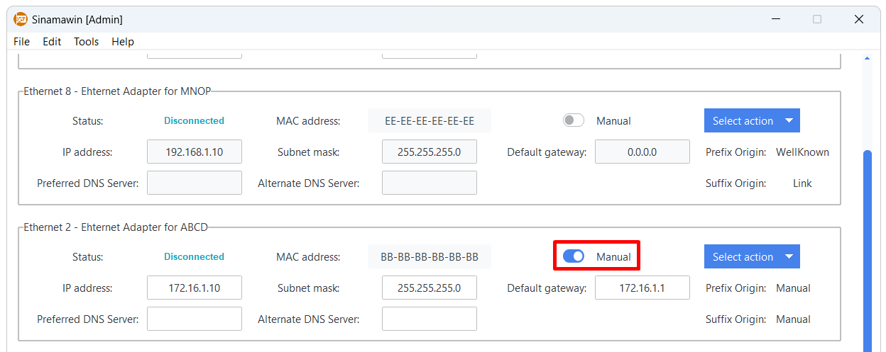

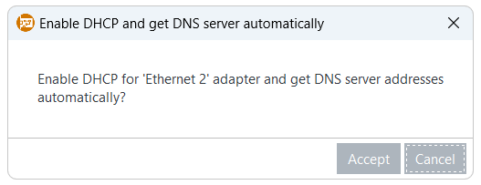

### 💾 Manage profiles to apply them later to the adapters

Different configurations (profiles) can be saved so that they can be quickly applied to the network adapters. In the "Select action" menu, the current configuration of an adapter can be saved for use on another adapter or at a later time.

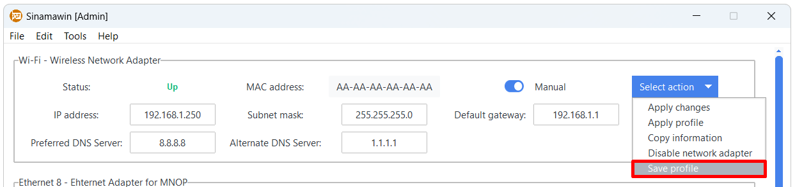

A new popup window will appear to name the profile and modify it if necessary.

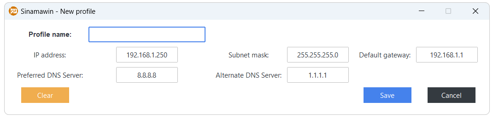

All stored profiles can be managed from "Profiles" in "Edit".

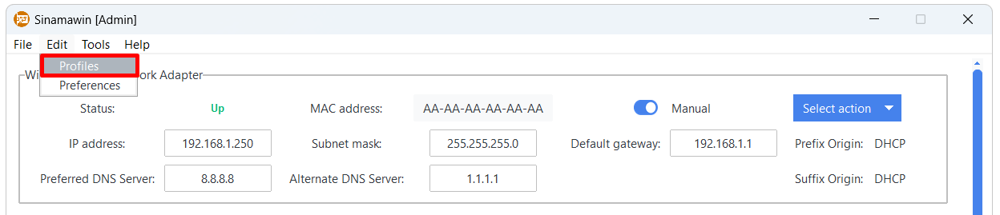

In the manage profiles popup window you can view all stored profiles, as well as add new ones and edit or delete an existing one. In addition, the option to import and export profiles in CSV is added. When importing a profile, if an existing name is detected, the imported profile will have the tag "_[number]" added to the name, thus preserving both.

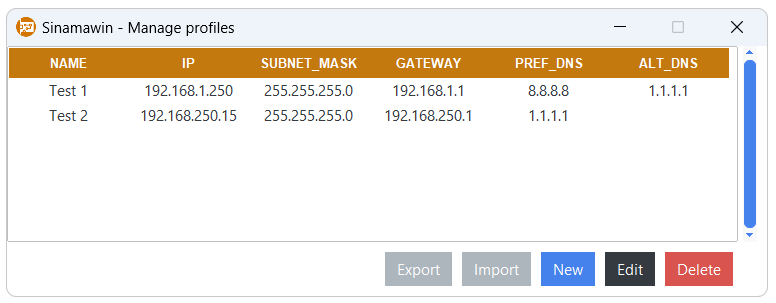

To apply a stored profile to an adapter, it must be done from the "Select action" menu and with the "Manual" option enabled.

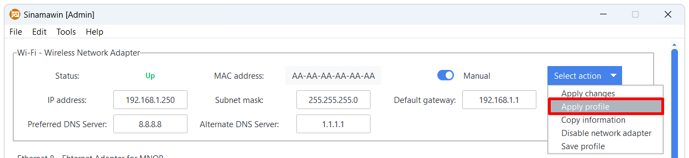

A popup window with the stored profiles will appear with two options: "Select" and "Select & Apply". The "Select" option copies the configuration to the network adapter, but without applying it, so that it can be modified. The "Select & Apply" option, on the other hand, applies the configuration, but requests confirmation before applying it.

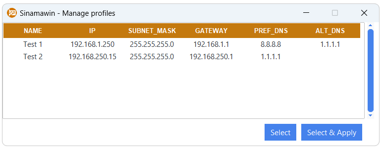

### 🔬 ARP (Address Resolution Protocol)

The ARP module, available in "Tools", allows consulting the current arp cache tables for an interface. If a IP destination address is specified, a ping is performed to that IP and the table is then obtained. In addition, if the IP is found in the arp tables, it is highlighted in green.

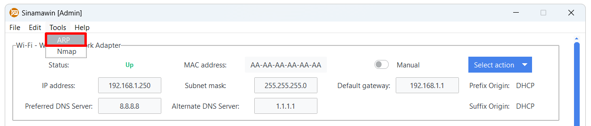

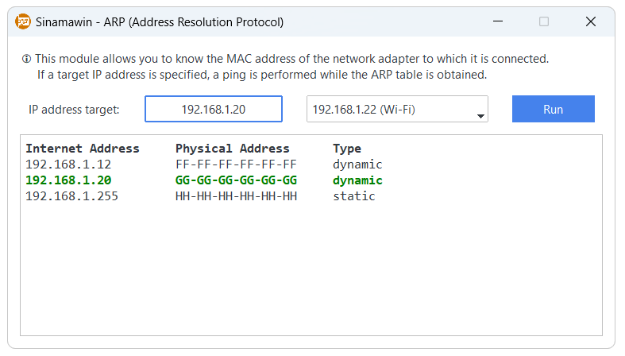

### 👁️ Nmap (Network Mapper)

To use this module it is necessary to install the [Nmap](https://nmap.org/download.html#windows) tool in Windows. It is accessible under "Tools" and allows a simple and fast port scanning.

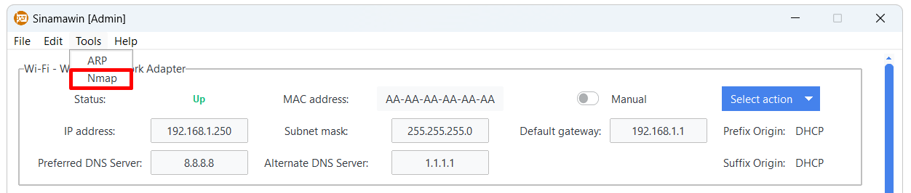

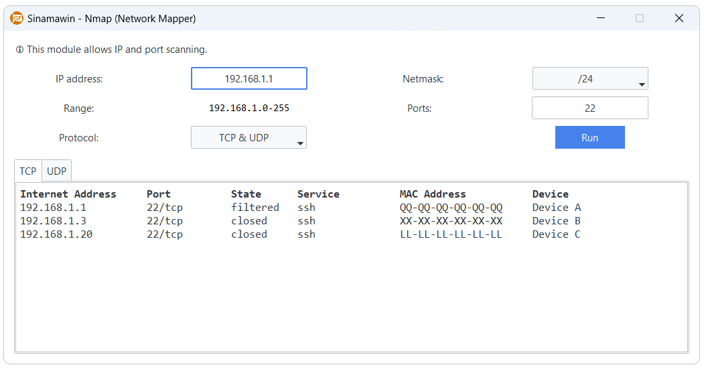

### 👕 Dress as you like

Everyone has a different style, so the application allows you to choose the theme that best suits you. The theme can be modified from "Preferences" in "Edit" and for the changes to take effect the application must be restarted. A list of all available themes can be found [here](https://ttkbootstrap.readthedocs.io/en/latest/themes/).

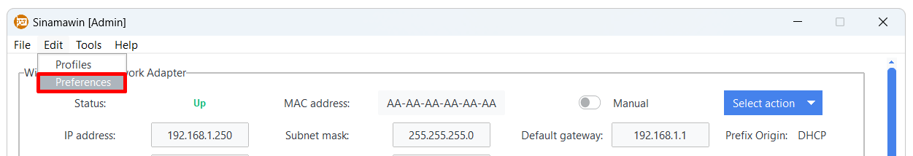

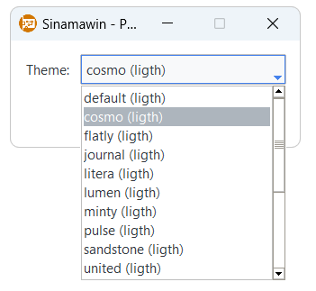

## Tested screen resolutions

The application has been tested and adapted for these screen resolutions. If your screen does not display correctly, please [contact me](mailto:javierorp@outlook.com) to try to solve it.

|              |              |              |              |
| ------------ | ------------ | ------------ | ------------ |
| 1093x614 px  | 1097x617 px  | 1280x720 px  | 1360x768 px  |
| 1366x768 px  | 1463x914 px  | 1707x1067 px | 1920x1080 px |
| 2048x1280 px | 2560x1440 px | 2560x1600 px | 2752x1152 px |
| 2293x960 px  | 3440x1440 px |              |              |

## Licenses

This application is distributed under GNU General Public License version 3 ([GPLv3](https://github.com/javierorp/Sinamawin/blob/main/LICENSE)).

The licenses of the technologies used to create this application can be found on their respective websites:

- [Python](https://docs.python.org/3/license.html)
- [Tkinter](https://docs.python.org/3/library/tkinter.html)
- [Tcl/Tk](https://www.tcl.tk/software/tcltk/license.html)
- [ttkbootstrap](https://ttkbootstrap.readthedocs.io/en/latest/license/)

Some of the icons used are from [Freepik](https://www.freepik.com).
