# Sinamawin

**<ins>Si</ins>mple <ins>N</ins>etwork <ins>A</ins>dapter <ins>Ma</ins>nager for <ins>Win</ins>dows**

A quick and easy way **to manage network adapters** in Windows (only **IPv4** for now).

:arrow_double_down: [Download](https://github.com/javierorp/Sinamawin/releases)

If you detect any error, have any doubt, suggestion or want to contact me you can do it via:

  

## Table of Contents

- [Sinamawin](#sinamawin)
  - [Table of Contents](#table-of-contents)
  - [Features](#features)
  - [How to](#how-to)
    - [How to copy all the information about a network adapter?](#how-to-copy-all-the-information-about-a-network-adapter)
    - [How to enable/disable a network adapter?](#how-to-enabledisable-a-network-adapter)
    - [How to modify the properties of a network adapter?](#how-to-modify-the-properties-of-a-network-adapter)
    - [How to set DHCP for a network adapter?](#how-to-set-dhcp-for-a-network-adapter)
    - [How to save a profile?](#how-to-save-a-profile)
    - [How to apply a profile?](#how-to-apply-a-profile)
    - [How to manage saved profiles?](#how-to-manage-saved-profiles)
  - [Tested screen resolutions](#tested-screen-resolutions)
  - [Licenses](#licenses)

## Features

To modify the properties of the network adapters it is required to run the application as an administrator.

- [x] View all network adapters in the computer.
- [x] Copy all the information of each network adapter (index,name, description, status, MAC address, IP address, subnet mask, default gateway, prefix origin, suffix origin, preferred and alternate DNS server).
- [x] Enable/disable the network adapter.
- [x] Change the configuration of network adapters.
- [x] Set DHCP configuration for a network adapter.
- [x] Save and manage profiles to be applied to network adapters.

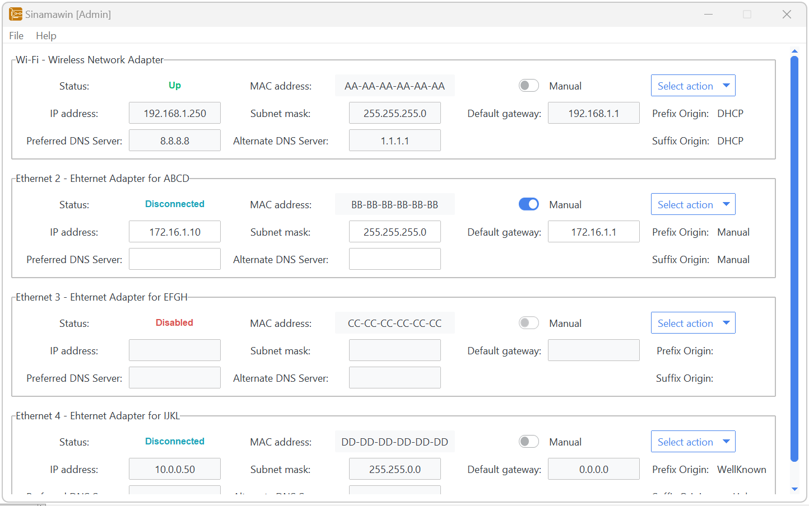

If the application is not running as administrator, a banner will appear at the top.

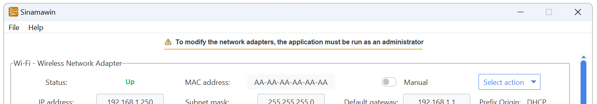

## How to

### How to copy all the information about a network adapter?

Click on "Select action" and select "Copy information". The network adapter information will be copied to the clipboard.

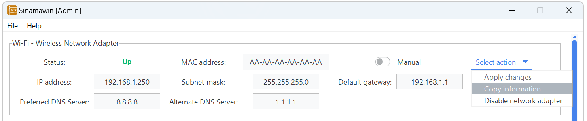

### How to enable/disable a network adapter?

Click on "Select action" and select "Enable/Disable network adapter". A confirmation dialog box will appear and, if accepted, the network adapter will be enabled/disabled. Afterwards, the network adapter information will be refreshed.

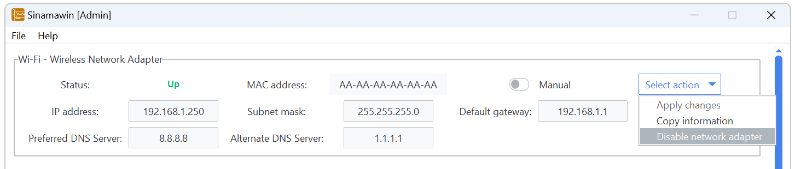

### How to modify the properties of a network adapter?

To modify the properties of a network adapter, the "Manual" check button must be activated. Once the configuration is specified in each field, select "Apply changes" in the "Select change" button. A confirmation dialog box will appear and, if accepted, the configuration will be applied. Afterwards, the network adapter information will be refreshed.

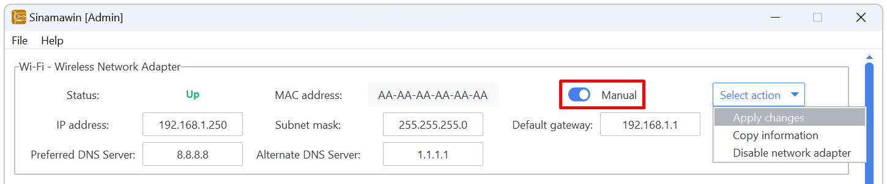

### How to set DHCP for a network adapter?

If the "Manual" check button is enabled, disabling it activates the DHCP setting for the network adapter. A confirmation dialog box will appear and, if accepted, the configuration will be applied. Afterwards, the network adapter information will be refreshed.

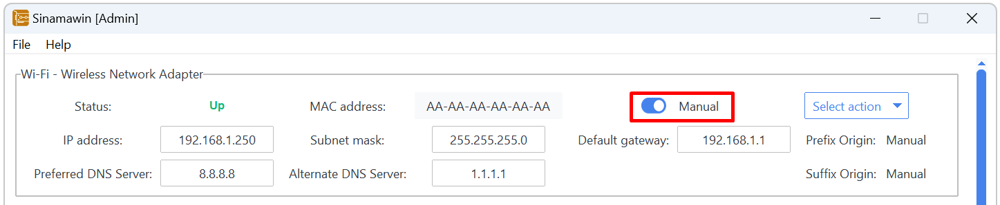

### How to save a profile?

Click on "Select action" and select "Save profile". A modal window will appear to set an alias to the profile and modify the values before saving it.

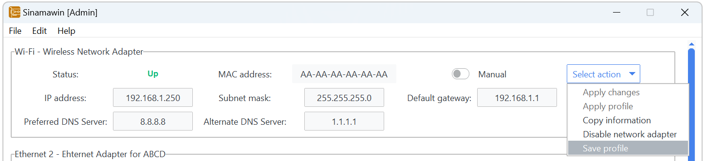

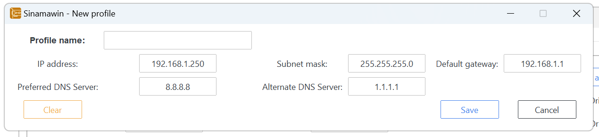

### How to apply a profile?

Click on "Select action" and select "Apply profile". The manage profiles window will appear and the chosen profile can be selected. If "Select" is clicked, the profile will be copied to the network adapter but will not be applied. If "Select & Apply" is clicked, the profile will be applied to the network adapter.

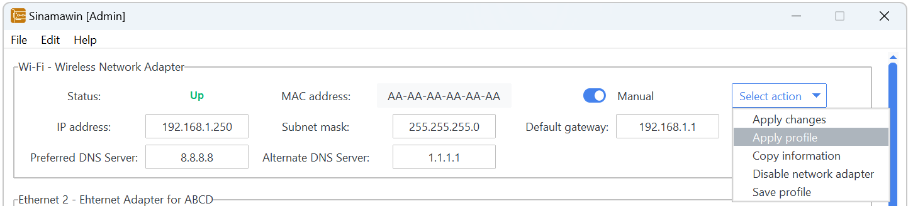

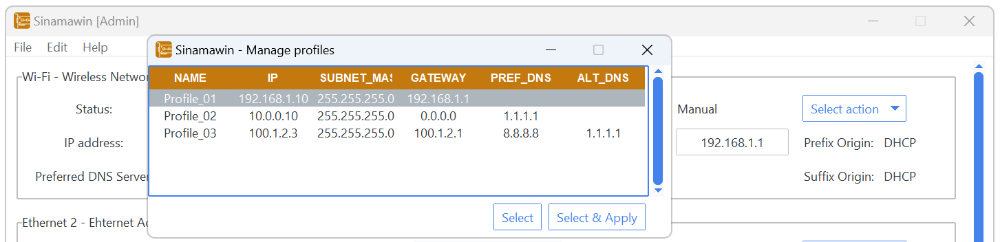

### How to manage saved profiles?

Click on "Edit" on the top toolbar and select "Profiles". The manage profiles window will appear and a new profile can be added and an existing profile can be edited or deleted.

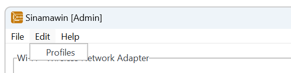

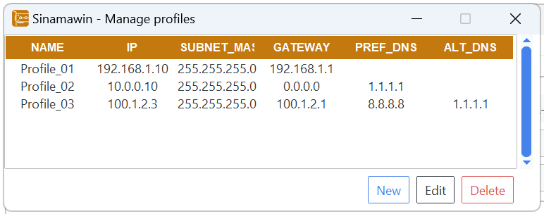

## Tested screen resolutions

The application has been tested and adapted for these screen resolutions. If your screen does not display correctly, please [contact me](mailto:javierorp@outlook.com) to try to solve it.

|              |              |              |              |
| ------------ | ------------ | ------------ | ------------ |
| 1093x614 px  | 1097x617 px  | 1280x720 px  | 1360x768 px  |
| 1366x768 px  | 1463x914 px  | 1707x1067 px | 1920x1080 px |
| 2048x1280 px | 2560x1440 px | 2560x1600 px | 2752x1152 px |
| 2293x960 px  | 3440x1440 px |              |              |

## Licenses

This application is distributed under GNU General Public License version 3 ([GPLv3](https://github.com/javierorp/Sinamawin/blob/main/LICENSE)).

The licenses of the technologies used to create this application can be found on their respective websites:

- [Python](https://docs.python.org/3/license.html)
- [Tkinter](https://docs.python.org/3/library/tkinter.html)
- [Tcl/Tk](https://www.tcl.tk/software/tcltk/license.html)
- [ttkbootstrap](https://ttkbootstrap.readthedocs.io/en/latest/license/)

Some of the icons used are from [Freepik](https://www.freepik.com).
